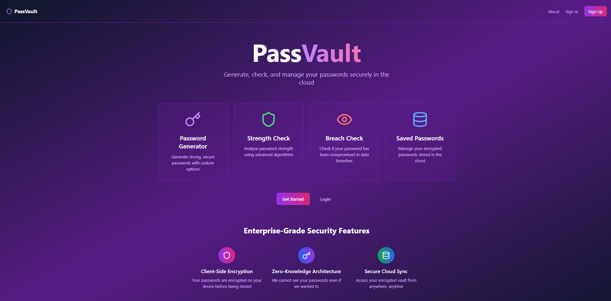

# PassVault - Enterprise Password Management Platform

**Check out the Project Here:** [PassVault](https://pass-vault-five.vercel.app/)

A comprehensive, security-first password management solution built with modern web technologies.  
PassVault combines cryptographically secure password generation, advanced breach detection, and zero-knowledge cloud storage to provide **enterprise-grade password security** for individuals and teams.
 

---

## Core Features

### Password Generation & Analysis
- **Cryptographically Secure Generation**: Uses Web Crypto API with configurable complexity (12–50 characters)  
- **Advanced Strength Analysis**: Real-time `zxcvbn` algorithm implementation with entropy calculations  
- **Breach Detection**: Integration with **HaveIBeenPwned API** using k-anonymity for privacy protection  
- **Personal Context Awareness**: Analyzes passwords against personal information to detect vulnerabilities  

### Zero-Knowledge Cloud Storage
- **Client-Side Encryption**: AES-256-GCM encryption before cloud storage  
- **Zero-Knowledge Architecture**: Server cannot decrypt user passwords  
- **Cross-Device Sync**: Encrypted vault accessible from any device  
- **Secure Search**: Encrypted search functionality across stored passwords  

### Security Intelligence
- **Comprehensive Security Reports**: Automated analysis of entire password vault  
- **Breach Monitoring**: Real-time checking of stored passwords against breach databases  
- **Strength Distribution Analytics**: Visual breakdown of password security levels  
- **Personalized Recommendations**: AI-driven suggestions for security improvements  

### Enterprise Authentication
- **Multi-Provider OAuth**: Google, GitHub integration via Supabase Auth  
- **Password Reset Flow**: Secure email-based password recovery  
- **Session Management**: JWT-based authentication with automatic refresh  
- **Row-Level Security**: Database-level access control  

---

## 📌 Tech Stack
- **Frontend**: React 18, TypeScript, Tailwind CSS  
- **Backend**: Supabase (PostgreSQL + Row-Level Security)
- **Encryption**: AES-256-GCM, Web Crypto API  
- **Auth**: Supabase Auth (OAuth 2.0 + JWT)  
- **APIs**: HaveIBeenPwned (breach detection), zxcvbn (strength analysis)  
- **Deployment**: Vercel (frontend), Render (backend)  
